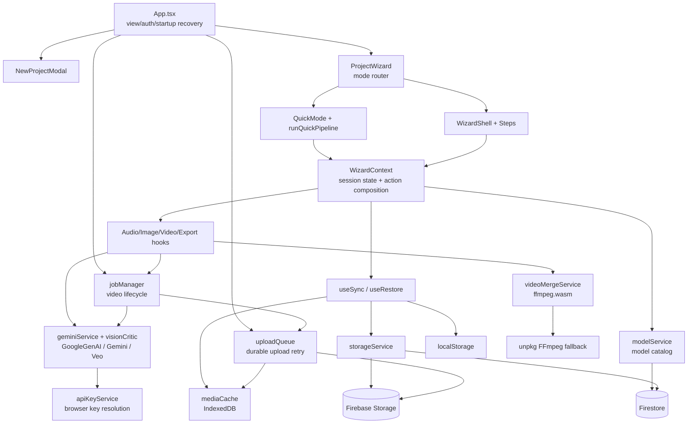
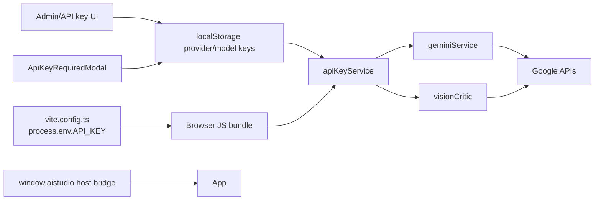

# VibeVideo 현재 의존성 지도

## 1. 한눈에 보는 런타임



핵심 결론은 UI가 application/domain/provider/persistence를 직접 또는 한 단계 hook을 통해 모두 의존한다는 점이다. dependency inversion이 없고 `WizardContext`가 composition root이자 mutable aggregate다.

## 2. 계층별 실제 의존성

| 발신 | 수신 | 의존 내용 | 결합 수준 |
|---|---|---|---|
| `App.tsx` | Firebase Auth | 세션과 접근 제어 | 직접 |
| `App.tsx` | `jobManager`, `uploadQueue` | 로그인 시 복구 순서 | 직접 |
| `ProjectWizard` | `WizardContext` | 모드 및 복원 상태 | 직접 |
| `QuickMode/runQuickPipeline` | context actions | 단계 오케스트레이션 | 직접 |
| Step components | `WizardContext` | 도메인 state와 commands | 직접 |
| action hooks | `geminiService` | 텍스트/오디오/이미지/비디오 | Google 특화 |
| image hook | `visionCritic` | Gemini critic | Google 특화 |
| video hook | `jobManager` | 장기 작업 | concrete singleton |
| `jobManager` | `geminiService` | Veo submit/poll/download | Google 특화 |
| sync/restore | `storageService`, `mediaCache`, localStorage | 다중 저장소 | concrete |
| `storageService` | Firestore/Storage SDK | cloud persistence | Firebase 특화 |
| export hook | `videoMergeService` | 브라우저 FFmpeg | concrete |

## 3. 데이터와 제어 흐름

### 3.1 생성

```text
Button / Quick pipeline
  -> WizardContext action wrapper
  -> useAudioActions | useImageActions | useVideoActions
  -> geminiService (or jobManager -> geminiService)
  -> apiKeyService resolves browser key
  -> GoogleGenAI Gemini/Veo
  -> scene state
  -> mediaCache + Firebase Storage
  -> useSync -> local backup + Firestore
```

텍스트, 이미지, 오디오, 비디오가 하나의 `geminiService.ts`에 집중되어 있다. 모델 catalog에 provider 필드가 있어도 실행 dispatch가 provider-neutral contract는 아니다.

### 3.2 복구

```text
Firebase auth callback
  -> uploadQueue.resumeAll()
  -> jobManager.autoResumePendingOperations(uid)
  -> jobManager.loadInterruptedFromProjects(uid)

Wizard mount
  -> useRestore
  -> cloud Project + localStorage backup + IndexedDB meta/media
  -> progress-score selection + index merge + healing
  -> WizardContext state
```

startup recovery와 wizard restore가 별도 진입점에서 같은 project/job/media 상태를 만진다. 명시적 transaction/lease가 없으므로 중복 실행 방지는 singleton과 persisted status에 의존한다.

### 3.3 내보내기

```text
Step7Export
  -> useExportActions
  -> visible scenes + brand kit + caption options
  -> videoMergeService
  -> local @ffmpeg/core OR unpkg CDN
  -> Blob URL / browser download
```

내보내기는 cloud job이 아니며 탭 수명, 기기 메모리, CORS, WASM/CDN 가용성에 묶인다.

## 4. API key 결합 지도



### 결합 지점

1. `vite.config.ts`가 `process.env.API_KEY`를 빌드 시 브라우저 코드로 치환한다.
2. `services/apiKeyService.ts`가 provider key, model key, env fallback을 브라우저에서 선택한다.
3. `components/ApiKeyRequiredModal.tsx`가 사용자가 입력한 Google key를 브라우저 저장소에 직접 저장한다.
4. `App.tsx`와 `WizardContext.tsx`가 AI Studio host bridge와 key-change event를 각각 처리한다.
5. `geminiService.ts`와 `visionCritic.ts`가 `new GoogleGenAI({apiKey})`를 직접 만든다.

### 상용화 의미

- 생성 자격증명이 사용자 브라우저에 노출되고 악성 extension/XSS/공유 기기/소스맵의 위험 범위에 들어간다.
- 서버 측 사용자 quota, abuse prevention, centralized revocation, billing attribution을 강제할 수 없다.
- provider 오류가 UI에 provider-specific 문자열로 전파된다.
- Firebase client API key와 유료 Google 생성 key를 같은 “API key”로 오해하지 않아야 한다.

## 5. 영속성 중복과 충돌 지도

| 데이터 | 중복 위치 | 현재 선택 규칙 | 위험 |
|---|---|---|---|
| Project metadata | React, Firestore, IDB, localStorage | 진행 점수 | 최신 수정 손실 |
| Scenes | React array, Firestore map/blob, backups | cloud read는 blob 우선, restore는 index 보충 | 최신 map patch 은폐, reorder 후 오병합 |
| Media | scene URL, Storage, IDB/data/blob URL | HTTP 우선 + IDB 보충 | upload 실패를 완료로 오인 |
| Job | memory, `generation_run`, operation map | status/operation 재연결 | submit-persist gap |
| Upload retry | memory, IDB/local metadata, scene meta | startup replay | 탭 미실행 시 정지 |
| Mode/settings | context, Project, per-project/global localStorage | 모드별 우선순위 | drift |

Firestore `version`이 존재하지만 일반 sync/복구는 optimistic concurrency나 revision merge에 사용하지 않는다. transaction helper `saveProjectWithConflictCheck`는 production caller가 없고, transaction 실패 시 unchecked save로 fallback한다. scenes는 안정 ID도 갖지만 현재 복구 보충은 주로 array index에 의존한다.

### Scene source-of-truth 단절

```text
full save
  -> scenes.json upload
  -> document keeps scenes_blob_url/path
  -> saved_scenes_map deleted

later partial sync / job / upload patch
  -> saved_scenes_map.* updated
  -> scenes blob remains unchanged

reload
  -> getProjectFromCloud sees blob pointer
  -> blob wins
  -> newer map patch is ignored
```

즉 `useSync`의 diff baseline과 `jobManager`/`uploadQueue`는 map이 읽기 source라고 가정하지만 `storageService`는 blob이 있으면 항상 blob을 source로 선택한다. 두 쓰기 경로 사이에 generation/version linkage가 없다.

## 6. 보안 경계

- `firestore.rules`: 프로젝트 owner read/write, 사용자 하위 컬렉션 owner, 모델 catalog signed-in read/admin write, default deny.
- `storage.rules`: `users/{uid}/**` owner read/write, default deny.
- client-side admin 표시와 Firestore admin authorization은 분리되어 있으나 앱의 관리 UI 자체는 browser code다.
- 생성 호출은 Firebase authorization 경계 밖에서 user-provided/global Google key로 직접 실행된다.
- Storage download URL은 bearer URL처럼 취급될 수 있으므로 로그/문서/telemetry에 원문을 남기지 않는 정책이 필요하다.

## 7. 운영성 결합

| 관심사 | 현재 위치 | 결손 |
|---|---|---|
| retry/backoff | `geminiService`, `uploadQueue`, storage helpers | 공통 정책/예산 없음 |
| polling/resume | `geminiService`, `jobManager` | server worker/lease 없음 |
| 비용 | `pricing.ts`, operation/video metadata | 실제 청구·quota 원장 없음 |
| 로그 | browser console | 중앙 수집, trace/correlation 없음 |
| 오류 | 문자열/alert/nullable critic | taxonomy, retryability, support code 없음 |
| 성능 | 일부 generation duration | stage SLO/percentile 없음 |
| idempotency | project operation records 일부 | 모든 generation command에 일관되지 않음 |

## 8. 의존성 절단 우선순위

1. **계약 관찰점 추가:** 현재 behavior를 characterization test와 typed command/result로 고정
2. **Domain snapshot 분리:** UI state와 persisted DTO 사이 mapper 도입
3. **Provider port:** Gemini/Veo 구현 앞에 text/image/audio/video interface
4. **Job port:** UI와 singleton `jobManager/uploadQueue` 사이 application interface
5. **Persistence port:** restore/sync가 Firestore/IDB/localStorage 구현을 직접 조합하지 않게 함
6. **Export port:** browser exporter를 동일 contract의 첫 구현으로 격리
7. **Backend 전환:** provider key와 장기 job을 서버로 이동하되 기존 browser adapter를 feature flag fallback으로 유지
