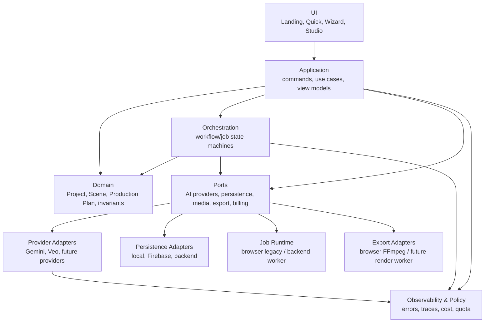

# VibeVideo 목표 아키텍처와 점진적 전환 경계

## 1. 설계 원칙

1. Big Bang 재작성 없이 현재 흐름 주위에 경계를 만든다.
2. UI는 provider SDK, Firebase document shape, FFmpeg 명령을 알지 않는다.
3. Project/Scene은 제품 도메인이고 provider operation/Storage URL은 실행 메타데이터다.
4. 장기 작업은 idempotent command, durable state machine, resume token을 갖는다.
5. 로컬 우선 사용성과 Sample은 유지하되 상용 생성·과금은 서버 권한 경계를 통과한다.
6. adapter 교체 전 characterization test로 현재 동작을 고정한다.

## 2. 목표 논리 구조



## 3. 경계별 책임

### UI

- 화면 상태, 사용자 입력, 접근성, 진행 표시
- `ProjectViewModel`, `JobViewModel`만 소비
- Quick/Pro는 별도 데이터 모델이 아니라 같은 application commands를 다른 UX로 조합
- API key 원문, Firebase DTO, provider operation 객체를 직접 다루지 않음

### Application

예상 use case:

- Create/Open/CloneProject
- GenerateScript/SegmentScenes
- GenerateSceneAudio/Image/Video
- RunQuickProduction
- ResumeProduction
- SaveProject/ResolveRestoreConflict
- ExportProject

이 계층이 command id, cancellation, progress, error mapping을 정의한다. React hook은 이 계층의 얇은 binding이 된다.

### Domain

- `Project`, `Scene`, `CreativeBrief`, `Cast`, `Style`, `ProductionPlan`
- 단계 완료 조건과 scene reorder/hide 규칙
- provider-neutral media asset 및 generation intent
- 저장 DTO와 분리된 schema version/invariant

현재 `types.ts`는 UI, persistence, provider metadata가 섞여 있으므로 한 번에 교체하지 않고 mapper로 분리한다.

### Orchestration

- script → scenes → audio/image/video → critic/refine → assembly의 상태 machine
- scene별 idempotency key와 재시도 정책
- provider operation submit/poll/resume
- upload 완료와 generation 완료를 구분
- Quick, batch, single regenerate가 동일 command semantics 사용

초기 구현은 기존 `jobManager`를 감싸고, 이후 backend worker adapter로 교체한다.

### Provider ports/adapters

기능 기준 port를 권장한다.

```ts
interface TextGenerationPort { generateScript(...): Promise<...>; segmentScenes(...): Promise<...>; }
interface ImageGenerationPort { generate(...): Promise<GeneratedAsset>; }
interface AudioGenerationPort { generate(...): Promise<GeneratedAsset>; }
interface VideoGenerationPort {
  submit(...): Promise<ProviderOperationRef>;
  poll(ref: ProviderOperationRef): Promise<ProviderOperationState>;
  download(ref: ProviderOperationRef): Promise<GeneratedAsset>;
}
interface CriticPort { critique(...): Promise<QualityAssessment>; }
```

provider/model capabilities는 registry에서 선언하고 UI 조건문 대신 application validation에 사용한다. Gemini/Veo adapter가 최초 구현이며 현재 prompt/output normalization을 그대로 감싼다.

### Persistence/media/jobs

- `ProjectRepository`: revision을 포함한 load/save/list
- `MediaRepository`: asset ID와 상태(local/pending/available/failed)
- `JobRepository`: command, operation ref, attempt, heartbeat, result
- `LocalProjectRepository`: Sample/offline/fallback
- `CloudProjectRepository`: 처음에는 Firebase adapter, 이후 backend API adapter

복구는 “진행 점수로 자동 승자 선택”에서 revision/updatedAt/device/source를 보여주는 deterministic 정책으로 이동한다. 자동 병합은 scene ID 기반의 안전한 필드에만 제한한다.

### Export

`ExportPort`가 timeline snapshot을 입력받고 artifact/result를 반환한다. 현재 browser ffmpeg 구현을 adapter로 보존한다. 향후 server renderer는 같은 contract를 구현하며 feature flag로 선택한다.

## 4. 목표 작업 수명주기

```text
requested -> accepted -> submitted -> running
  -> generated -> uploading -> available
  -> failed_retryable | failed_terminal | cancelled
```

필수 속성:

- commandId/idempotencyKey
- user/project/scene scope
- provider/model snapshot
- input fingerprint
- operation reference
- attempt/nextAttemptAt
- generated asset과 durable upload 상태 분리
- normalized error code + provider support reference
- estimated/actual cost
- timestamps/heartbeat

`GenerationRun`을 즉시 제거하지 않는다. 먼저 새 application state와 양방향 mapper를 만든 뒤 기존 필드를 계속 기록하여 구버전 복구를 보존한다.

## 5. 단계적 전환의 seam

| 현재 구성요소 | 첫 이동 | 최종 방향 |
|---|---|---|
| `WizardContext` | facade 뒤에 commands/selectors 추가 | UI session store |
| `runQuickPipeline` | application orchestrator contract 사용 | workflow preset |
| action hooks | current behavior adapter | thin React bindings |
| `geminiService` | Gemini/Veo adapter로 포장 | provider별 adapter |
| `visionCritic` | CriticPort adapter | provider-neutral critic |
| `jobManager` | JobOrchestrator port 구현 | backend job client |
| `uploadQueue` | MediaUploadPort 구현 | backend/object worker |
| `useSync/useRestore` | repositories + mapper 사용 | revision-aware persistence |
| `storageService` | Firebase repository adapter | backend API adapter 선택 가능 |
| `videoMergeService` | BrowserExportAdapter | server render adapter 병행 |

## 6. 브라우저와 서버의 목표 경계

### 브라우저에 남는 것

- 편집 UI와 optimistic state
- Sample/preview
- 로컬 draft/cache
- 저위험 또는 offline 가능한 browser export fallback
- 사용자에게 보이는 진행/취소/retry

### 서버로 이동할 것

- 상용 provider credential
- generation authorization, quota, billing attribution
- 장기 operation polling과 upload
- idempotency/lease/retry
- audit log, centralized metrics
- 고용량 render 선택지

전환 기간에는 `ExecutionMode = browserLegacy | server` feature flag를 두고 프로젝트/사용자 cohort별로 비교한다. 서버 실패를 무조건 브라우저 key로 fallback하면 보안·과금 통제가 우회되므로 production에서는 명시적 정책으로만 허용한다.

## 7. 오류·비용·관측성 계약

정규화 error 예:

- `AUTH_MISSING`, `AUTH_REJECTED`
- `RATE_LIMITED`
- `INVALID_INPUT`, `UNSUPPORTED_CAPABILITY`
- `PROVIDER_TRANSIENT`, `PROVIDER_TERMINAL`
- `OPERATION_TIMEOUT`
- `UPLOAD_PENDING`, `UPLOAD_FAILED`
- `PERSISTENCE_CONFLICT`
- `EXPORT_RESOURCE_LIMIT`

모든 command는 correlation ID를 가지며 stage duration, retry, provider/model, asset status, estimated/actual cost를 구조화 event로 남긴다. prompt 본문, key, signed/download URL, 사용자 media는 기본 로그 금지다.

## 8. 호환성 전략

1. 기존 `Project` 문서를 읽고 쓰는 legacy mapper를 유지한다.
2. 새 필드는 optional additive로만 시작한다.
3. old/new path를 같은 fixture에 실행해 scene 수, prompt, 모델, media, step, operation metadata를 비교한다.
4. cloud sync off와 Sample은 backend 없이 계속 작동한다.
5. 실패 시 rollout flag를 되돌릴 수 있게 old adapter를 제거하지 않는다.
6. 저장 형식 destructive migration은 별도 승인·백업·dual-read 기간 전에는 하지 않는다.

## 9. 목표 상태의 완료 신호

- UI imports에서 Google/Firebase/FFmpeg SDK가 사라진다.
- provider 교체가 Wizard/Quick 수정 없이 가능하다.
- reload/다중 기기에서도 하나의 job만 실행된다.
- 생성 성공과 durable media availability가 구분된다.
- project save가 revision conflict를 탐지한다.
- server-side quota/cost/audit가 generation 승인과 원자적으로 연결된다.
- browser export와 server export가 동일 timeline fixture를 통과한다.
